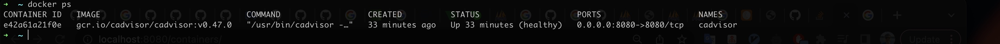
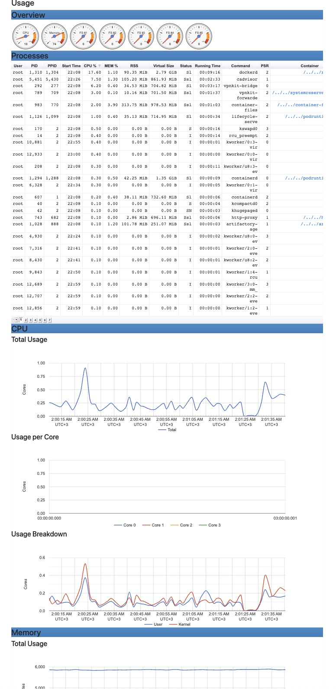
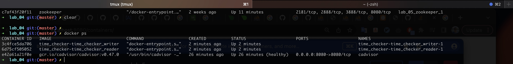
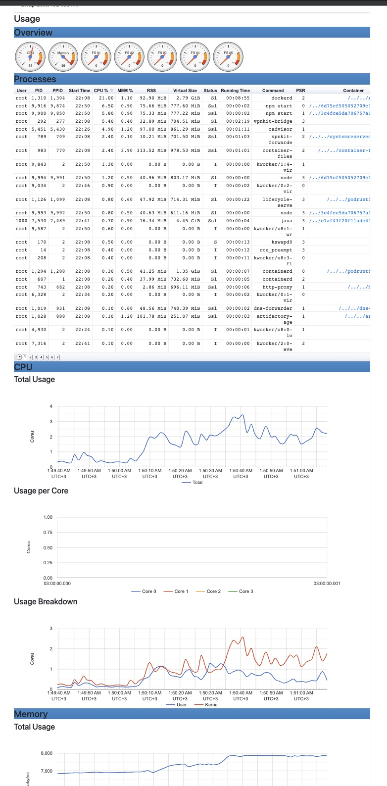
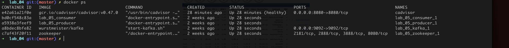

# Lab 6

```console
VERSION=v0.47.0 # use the latest release version from https://github.com/google/cadvisor/releases
sudo docker run \
  --volume=/:/rootfs:ro \
  --volume=/var/run:/var/run:ro \
  --volume=/sys:/sys:ro \
  --volume=/var/lib/docker/:/var/lib/docker:ro \
  --volume=/dev/disk/:/dev/disk:ro \
  --publish=8080:8080 \
  --detach=true \
  --name=cadvisor \
  --privileged \
  --device=/dev/kmsg \
  gcr.io/cadvisor/cadvisor:$VERSION
```

## Initial system state




## Lab 4 system state




## Lab 5 system state




## Error 😕

http://localhost:8080/docker/

```console
failed to get docker info: Cannot connect to the Docker daemon at unix:///var/run/docker.sock. Is the docker daemon running?
```


[github issue](https://github.com/docker/for-mac/issues/6531)
